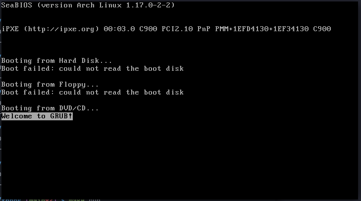

# THBOS

A minimal x86 operating system that displays CPU information using the CPUID instruction.



## Features

- Boots via GRUB using Multiboot specification
- VGA text mode display with color support
- Screen scrolling implementation
- CPUID instruction wrapper
- Displays CPU vendor, family, model, stepping
- Shows processor feature flags (SSE, AVX, etc.)
- Binary and hexadecimal number formatting

## Technical Details

### Architecture
- **Target**: x86 (32-bit protected mode)
- **Bootloader**: GRUB (Multiboot 0.6.96)
- **Display**: VGA text mode at 0xB8000
- **Memory**: 1MB kernel load address, 16KB stack

### Key Improvements Over Original
- Here's the previous repo [cpuinfo-os](https://github.com/thehackersbrain/cpuinfo-os)
1. Fixed VGA buffer size (2000 vs 2200)
2. Proper screen scrolling instead of clearing
3. Corrected bit masking in CPUID parsing
4. Fixed CPUID inline assembly with proper constraints
5. Added CPUID availability check
6. Displays CPU vendor string (leaf 0x00)
7. Shows ECX feature flags (SSE3, AVX, AES, etc.)
8. Added hexadecimal printing function
9. Fixed binary printing for zero values
10. Increased stack from 4KB to 16KB

## Requirements

- GCC (with 32-bit support)
- GNU Binutils (as, ld)
- GRUB utilities (grub-mkrescue)
- QEMU (for testing)
- xorriso (dependency for grub-mkrescue)

### Ubuntu/Debian
```bash
sudo apt install build-essential gcc-multilib grub-pc-bin xorriso qemu-system-x86 qemu-ui
```

### Arch Linux
```bash
sudo pacman -S base-devel grub xorriso qemu-arch-extra qemu-ui-sdl
```

## Building

### Using Make (recommended)
```bash
make            # Build ISO
make run        # Build and run in QEMU
make clean      # Clean build artifacts
make debug      # Run with GDB debugging
```


### Manual Build
```bash
# Assemble bootloader
as --32 boot.s -o boot.o

# Compile kernel
gcc -m32 -c kernel.c -o kernel.o -ffreestanding -O2 -Wall -Wextra

# Link
ld -m elf_i386 -T linker.ld -o THBOS.bin boot.o kernel.o

# Create ISO
mkdir -p build/isodir/boot/grub
cp THBOS.bin build/isodir/boot/
cp grub.cfg build/isodir/boot/grub/
grub-mkrescue -o THBOS.iso build/isodir
```

## Running

### QEMU
```bash
qemu-system-x86_64 -cdrom THBOS.iso -m 512M -display sdl
```

### VirtualBox
1. Create new VM (Type: Other, Version: Other/Unknown)
2. Disable EFI
3. Mount THBOS.iso as CD
4. Boot

### Real Hardware
Write ISO to USB:
```bash
sudo dd if=THBOS.iso of=/dev/sdX bs=4M status=progress
```

## Code Structure

```bash
.
├── boot.s          # Assembly bootloader
├── kernel.c        # Main kernel code
├── kernel.h        # Type definitions and declarations
├── linker.ld       # Linker script
├── grub.cfg        # GRUB configuration
└── Makefile        # Build automation
```

## Memory Layout

```bash
0x00000000 - 0x000FFFFF: Real mode area (1MB)
0x00100000:              Kernel load address
0xB8000:                 VGA text buffer
```

## VGA Text Mode

- Resolution: 80×25 characters
- Format: 16-bit per character
  - Bits 0-7: ASCII character
  - Bits 8-11: Foreground color
  - Bits 12-15: Background color

## CPUID Information Displayed

### Leaf 0x00 (Basic Info)
- CPU vendor string (GenuineIntel, AuthenticAMD, etc.)
- Maximum supported CPUID leaf

### Leaf 0x01 (Features)
- **EAX**: Stepping, Model, Family IDs
- **EBX**: Brand index, Cache line size, APIC ID
- **ECX**: SSE3, SSSE3, SSE4.1/4.2, AES, AVX, etc.
- **EDX**: FPU, VME, TSC, MSR, PAE, MMX, SSE, SSE2, etc.

## Debugging

### With GDB
```bash
# Terminal 1
qemu-system-x86_64 -cdrom THBOS.iso -m 512M -s -S

# Terminal 2
gdb THBOS.bin
(gdb) target remote localhost:1234
(gdb) break kernel_entry
(gdb) continue
```

### QEMU Monitor
```bash
qemu-system-x86_64 -cdrom THBOS.iso -monitor stdio
```

## Known Limitations

- No interrupt handling (IDT)
- No keyboard input
- No disk I/O
- Uses GRUB's GDT (no custom GDT)
- No memory management
- Single-threaded
- No floating point support

## Future Enhancements

1. IDT setup with interrupt handlers
2. Keyboard driver (IRQ1)
3. Timer (PIT) for scheduling
4. Custom GDT
5. Memory management (paging)
6. Shell interface
7. Extended CPUID leaves (cache info, thermal, etc.)
8. PCI device enumeration


## References

- [Intel® 64 and IA-32 Architectures Software Developer's Manual](https://software.intel.com/content/www/us/en/develop/articles/intel-sdm.html)
- [OSDev Wiki](https://wiki.osdev.org/)
- [Multiboot Specification](https://www.gnu.org/software/grub/manual/multiboot/multiboot.html)
